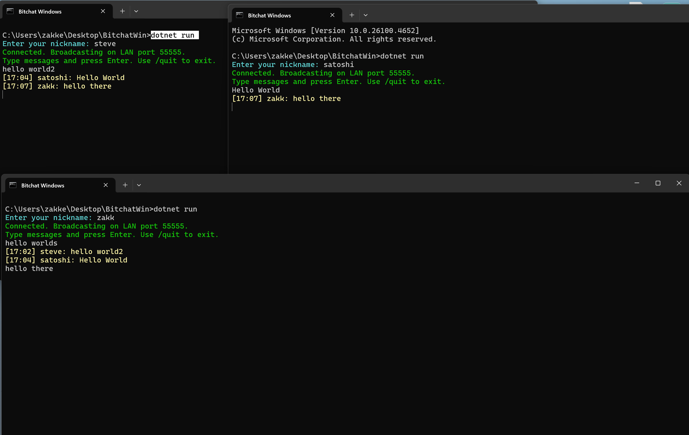

````markdown
# Bitchat Windows


> **"We will not find freedom in permissioned systems."**  
> — *Inspired by Satoshi Nakamoto*

---

### **What is this?**
A **pure peer‑to‑peer LAN chat client** for Windows — no servers, no accounts, no central authority.  
It runs **entirely offline** over your local network.  

Originally inspired by [Jack's Bitchat](https://github.com/permissionlesstech/bitchat) for iOS/macOS,  
this is the **Windows implementation** that didn’t exist — until now.  

- **Zero setup** — just run and chat.  
- **No servers** — nothing to shut down.  
- **No tracking** — everything stays local.  

---

### **What’s New (v1.1)**
- **Multiple instances** can now run on the same machine (port sharing enabled).  
- **Improved output** with timestamps and colored messages.  
- **Polished shutdown behavior** for cleaner exits.  

---

### **Screenshot**


---

### **Quick Start**
```bash
# 1. Clone the repo
git clone https://github.com/zakkeasterbrook/bitchat-windows.git
cd bitchat-windows

# 2. Run
dotnet run

# 3. Chat
Enter a nickname.
Type messages.
Broadcast to everyone on your local network.

# 4. Quit
/quit
````

---

### **Planned Commands**

```
/join #room      -> Switch to a channel
/rooms           -> List available rooms
/msg <user>      -> Direct message
/quit            -> Exit
```

---

### **Future Development**

This first version is **LAN‑only** (local Wi‑Fi or wired networks).

**Planned next phases:**

* **End‑to‑end encryption** (Noise Protocol)
* **IRC‑style channels** (`/join #room`)
* **Modern Windows GUI** (WinUI 3)
* **Bluetooth mesh support** → true off‑grid peer‑to‑peer communication, bringing this Windows client in line with the vision of the original iOS app.

---

### **Why?**

Centralized messengers can be censored, monitored, or shut down.
**Bitchat is small, simple, and can’t be stopped.**

*"If you don’t believe it or don’t get it, I don’t have time to try to convince you, sorry."*
— *Satoshi Nakamoto*

---

### **Credits**

* Original Bitchat by [Jack](https://github.com/permissionlesstech)
* Windows port by [Zakk](https://github.com/zakkeasterbrook)

---

### **License**

MIT — Use it, fork it, improve it.

